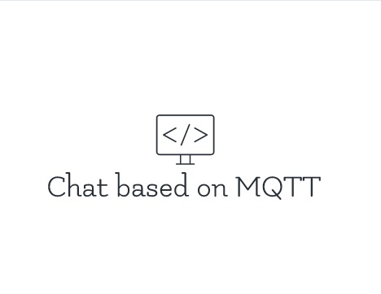

<p align="center">
    <br />
    
    
    
</p>

# Chat Based On MQTT Protocol
Chat application based on the MQTT protocol


## Features

* Implemented in C language;
* Developed on the Linux platform;

## Starting

### 1. Dependencies

To execute the project, you will initially need to install the following dependencies:

- [C >=99 compiler](https://gcc.gnu.org/);
- [CMake >=3.0](https://cmake.org/);
- [GNU Make or Ninja](https://www.gnu.org/software/make/);

### 2. Settings

After the installation of the premises, it is necessary to obtain a copy of the project, to do this, clone the project or `fork` it through the button located in the upper right corner and then clone it on your machine.

### 3. Project structure

The project is structured as follows:

| Folder   | Content               |
|----------|-----------------------|
| app/     | Executable files      |
| include/ | Header files          |
| src/     | Source routines files |

## Instructions

To clone and compile the repository you need to:

#### GNU Make

```sh
git clone https://github.com/henriqueherrera/Chat-based-on-MQTT-protocol
cd Chat-based-on-MQTT-protocol && mkdir build && cd build && cmake ../ && make -j
```

#### Ninja

```sh
git clone https://github.com/henriqueherrera/Chat-based-on-MQTT-protocol
cd router-simulation && mkdir build && cd build && cmake .. -G "Ninja"
ninja
```

### Running the project

Finally, after following the previous steps, to run the project, in the build folder, execute the following command:

```
./CHAT
```